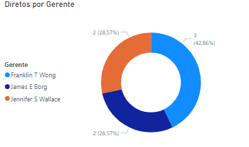
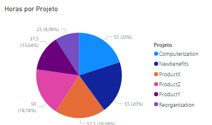

# DIO - Python Data Analytics

### Desafio - Processando e Transformando Dados com Power BI

### Realizado

- [x] Cabeçalhos e tipos de dados
- [x] Modificação de dados monetários para decimal fixo
- [x] Verificação de nulos
- [x] Verificar se existem employees sem gerente
- [x] Verificar se existem departamentos sem gerentes, e completar o dado
- [x] Verificar horas por projeto
- [x] Separação de dados complexos
- [x] Mesclar consultas employee e departament para criar uma tabela employee com o nome dos departamentos associados aos colaboradores
- [x] Junção dos colaboradores e respectivos nomes dos gerentes
- [x] Mesclar as colunas de Nome e Sobrenome
- [x] Mescle os nomes de departamentos e localização
- [x] Agrupe os dados a fim de saber quantos colaboradores existem por gerente
- [x] Elimine as colunas desnecessárias, que não serão usadas no relatório

## Screenshots

